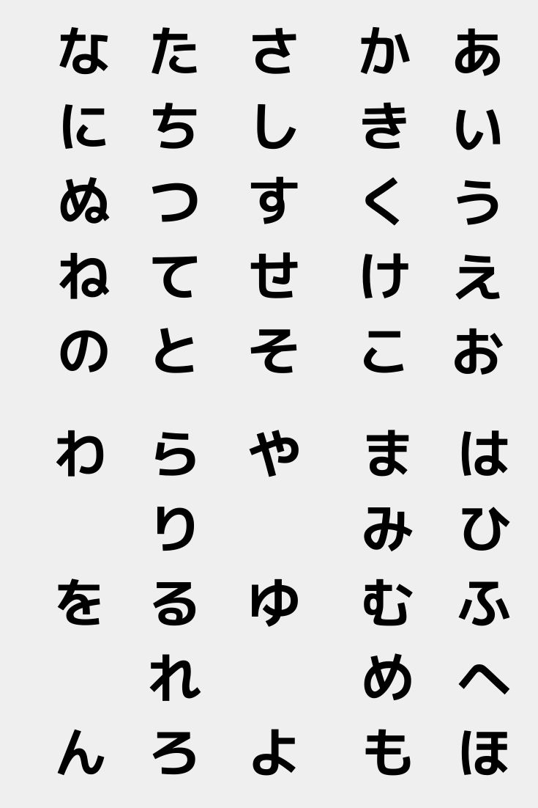
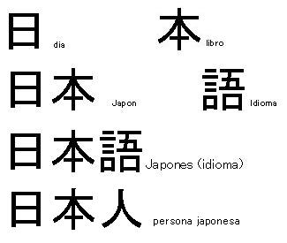
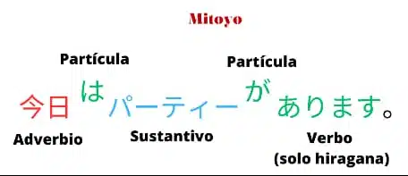
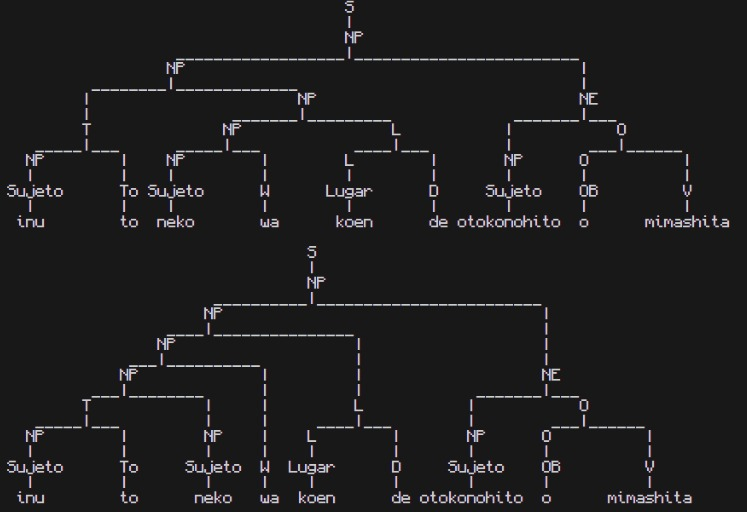
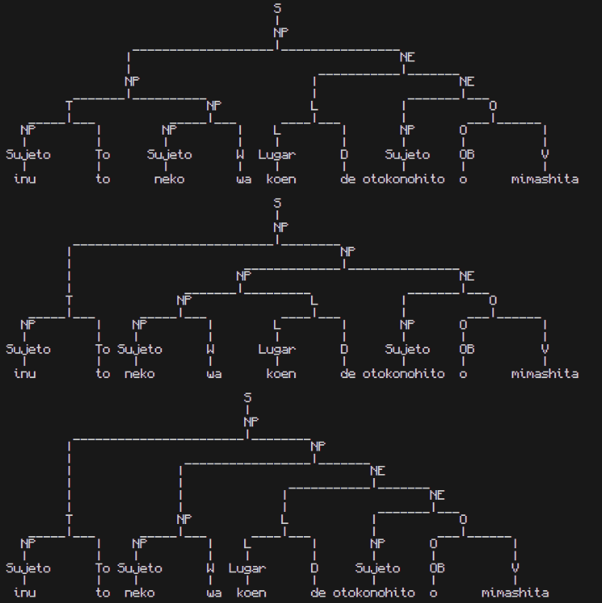
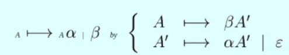
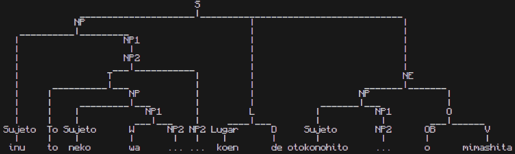
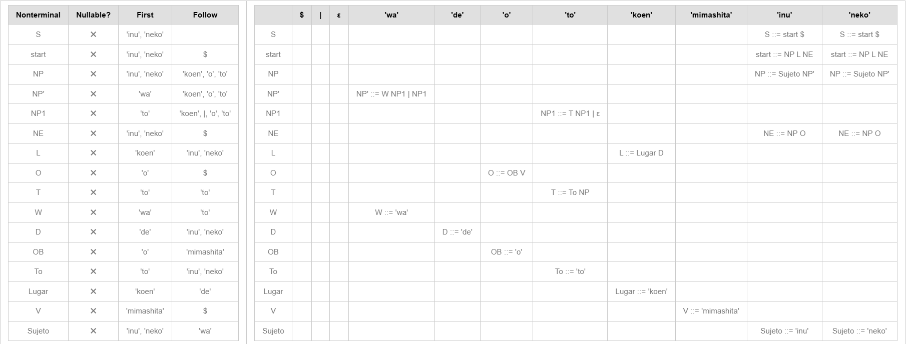

# Generación y Limpieza de Gramática

## Alejandro Adrián García Martínez

## Descripción 
Para esta evidencia se creó una gramática con el lenguaje Japonés, principalmente uso el 'Hiragana' romaji el cuál facilita su escritura para el procesamiento de la computadora.



El languaje japonés es una lengua aglutinante que posee un sistema de escritura algo complejo distribuidos en 3 tipos de glifos. Los Kanji, que son símbolos que representan palabras completas, como objetos, personas o animales por ejemplo. Así mismo hay dos silbalarios, el hiragana y el katakana.



En este lenguaje la estructura de la oración es la siguiente:



Siendo el Adverbio/Sujeto de la oración, la partícula ‘wa’ que indica que es lo principal de la oración, el sustantivo la partícula que conecta con el verbo que se encuentra al final de la oración.

Para esta gramática se creó el siguiente lenguaje:
```
'wa' (partícula de la oración indica el sujeto o sujetos principales)
'de' (partícula que da énfasis al lugar)
'o' (Partícula que conecta a los dos verbos que se usarán en esta gramática)
'to' (Conjunción copulativa ‘y’)
'koen' | 'mise' | 'eki' (parque | tienda | casa)
'mimashita' | 'kikimashita' (vió | escuchó)
'inu' | 'neko' | 'tori' | 'otoko no hito' (perro | gato | pájaro | persona)
```

## Modelos
### Primera gramática (Con ambigüedad y recursividad izquierda)
La primera gramática generada fue la siguiente:
```
S -> NP
NP -> NP NE | NP W | NP L | T NP | Sujeto
NE -> L NE | NP O
L -> L D | Lugar
O -> O V | OB
T -> NP To
```
El lenguaje en japonés por naturaleza de su forma de escribir no tiene recursión a la izquierda, es por eso que esta gramática se diseñó para construir la oración desde el centro permitiendo generar múltiples formas de armar una misma oración.

La capacidad de esta gramática esta en generar una oración simple con uno o dos sujetos en la oración en un lugar realizando una acción simple como ver o escuchar y otro sujeto que sea el visto o escuchado. Se pueden cambiar los sujetos y los lugares pero el formato de la oración es el mismo.

Algunas oraciones de ejemplo son los siguientes:
```
inu wa koen de otokonohito o mimashita (JAP)
El perro vió un hombre en el parque (ESP)

tori to neko wa koen de inu o kikimashita (JAP)
El pájaro y el perro escucharon al perro en el parque (ESP)

tori wa mise de neko o kikimashita (JAP)
El pájaro escuchó un pajaro en la tienda (ESP)
```

Usaremos de ejemplo para la generación de árboles la siguiente oración
```
El perro y el gato vieron a un hombre en el parque (ESP)
inu to neko wa koen de otokonohito o mimashita (JAP)
```
Con esta oración se generan los siguientes árboles:






Con esto se sabe claramente que la gramática tiene recursividad por la izquierda así como es ambigua.

### Segunda gramática LL(1)
Primero es importante identificar dónde se genera la ambigüedad, en este caso rápidamente se ve que es en las llamadas ```NP```
```
NP -> NP NE | NP W | NP L | T NP | Sujeto
```
Al ser muchas las opciones por las que se puede recorrer es importante refactorizar este punto, así mismo al iniciar la gramática se reparte la responsabilidad a ```NP L NE``` para reducir la cantidad de llamadas a NP de forma eficiente.
Finalmente se eliminan algunas de las llamadas recursivas de ```NP``` llamando a Sujeto así eliminado la responsabilidad de ```NP``` y repartiendo la distribución de llamadas a través de la gramática, con esto eliminando la ambigüedad, pero aún teniendo la recursividad por izquierda.
```
S  -> NP L NE
NP -> Sujeto | Sujeto W | NP T             
NE -> NP O
L  -> L D | Lugar
O  -> O V | OB
T  -> To NP

W  -> 'wa'
D  -> 'de'
OB -> 'o'
To -> 'to'
Lugar -> 'koen' | 'mise' | 'eki'
V  -> 'mimashita' | 'kikimashita'
Sujeto -> 'inu' | 'neko' | 'tori' | 'otokonohito'
```
Para eliminar la recursividad por izquierda es necesario aplicar la fórmula vista en clase



De esta forma podemos refactorizar las funciones que se llaman así mismas para forzar una recursión hacia la derecha.
```
S -> NP L NE
NP -> Sujeto NP1
NP1 -> W NP2 | NP2
NP2 -> T NP2 | 
NE -> NP O
L -> Lugar D
O -> OB V
T -> To NP

W -> 'wa'
D -> 'de'
OB -> 'o'
To -> 'to'
Lugar -> 'koen' | 'mise' | 'eki'
V -> 'mimashita' | 'kikimashita'
Sujeto -> 'inu' | 'neko' | 'tori' | 'otokonohito'
```
Y nos permite generar el siguiente árbol



Eliminando la recursión por la izquierda y la ambigüedad en la gramática volviéndola LL(1)
(LL(1): Tablas generadas desde: https://www.cs.princeton.edu/courses/archive/spring20/cos320/LL1/)



## Algoritmo e Implementación
### Librería nltk
Para esta implemetación se utilizo la librería de python "nltk" la cuál permite generar los árboles de las oraciones con una gran facilidad.
Para instalarla hay que ingresar el siguiente comando en la terminal:
```
pip install nltk
```
Después podemos correr el programa de forma normal
```
python grammar.py
```
### Algoritmo
Una vez instalada la librería nltk se define la grmática de la siguiente forma:
```
grammar = CFG.fromstring("""
S -> NP
NP -> NP NE | NP W | NP L | T NP | Sujeto
NE -> L NE | NP O
L -> L D | Lugar
O -> O V | OB
T -> NP To

W -> 'wa'
D -> 'de'
OB -> 'o'
To -> 'to'
Lugar -> 'koen' | 'mise' | 'eki'
V -> 'mimashita' | 'kikimashita'
Sujeto -> 'inu' | 'neko' | 'tori' | 'otokonohito'
""")
```
Y se coloca la oración a revisar:
```
sentence = "inu to neko wa koen de otokonohito o mimashita"
```
Al correr el programa se nos imprimiran los abroles generados por la oración. para probar oraciones prpias basta con cambiar la oración entre comillas de la linea 28, si se imprime un arbol significa que la oración es válida, de lo contrario podemos saber que no lo es.

### Ejemplos
Oración: "tori wa mise de neko o kikimashita"
Árbol:


Oración: "inu wa koen de otokonohito o mimashita"
Árbol:


Oración: "neko wa mise de neko o mimashita"


## Jerarquía de Chomsky
### Antes
Analizando las reglas de la primera gramática, todas tienen un único no-terminal, esto cupliendo con la características de una gramática de Tipo 2 o Libre de contexto, es importante mencionar que al tener una ambigüedad y al ser recursivo por la izquierda o en otras palabras con la posibilidad de ser llamada múltiples veces será mucho más complicado de parsear con técnicas como LL(1).
### Después
Revisando la segunda gramática generada igualmente podemos concluir que es una gramática de Tipo 2 o Libre de contexto, sin embargo al eliminar el backtracking y la recursividad descendiente es mucho más fácil de parsear por lo tanto es mucho más eficiente que la primera gramática al poder comprobar la gramática de forma mucho más rápida.
## Conlcusión
Al eliminar la ambigüedad en la gramática de Tipo 2 podemos generar una gramática que se apegue más a un reconocimiento lineal más que a uno polinomial permitiendo parsear gramáticas con una dificultad incluso en algunos casos más rápido que una O(n3), ya que permite parsear con complejidad O(n) en la mayoría de los casos al ser LL(1).


## Referencias
Club Yamagata. (s.f.). CULTURA DE JAPON : Idioma. Recuperado de: https://www.clubyamagata.com/blog/cultura-japonesa/cultura-de-japon-idioma/

Conociendo Japon (s.f.). Estructura de las oraciones japonesas y verbo desu. Recuperado de: https://conociendojapon.com/japones/estructura-de-las-oraciones-japonesas-y-verbo-desu/

cgosorio (s.f.). Análisis LL (1). Recuperado de: http://cgosorio.es/BURGRAM/index8810.html?Los_algoritmos_de_an%E1lisis%0Asint%E1ctico:An%E1lisis_Sint%E1ctico%0ADescendente:An%E1lisis_LL_%281%29

Kincaid Zak, Zhu Shaowei. (s.f.). LL(1) Parser Visualization. Recuperado de: https://www.cs.princeton.edu/courses/archive/spring20/cos320/LL1/
