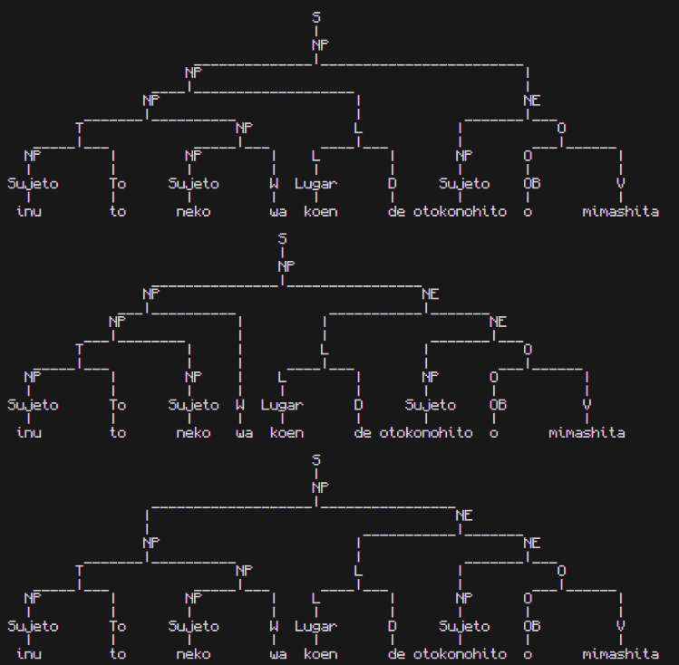

# Generación y Limpieza de Gramática

## Alejandro Adrián García Martínez

## Descripción 
Para esta evidencia se creó una gramática con el lenguaje Japonés, principalmente uso el 'Hiragana' romaji el cuál facilita su escritura para el procesamiento de la computadora.

En este vocabulario similar al español se juntan los símbolos para formar palabras, en este idioma igualmente existen los Kanjis, que son símbolos únicos que representan palabras completas muchas veces siendo conjunto de los símbolos del Hiragana incluso al juntar varios Kanjis se crean nuevas palabras.

En este lenguaje la estructura de la oración es la siguiente:

Siendo el Adverbio/Sujeto de la oración, la partícula ‘wa’ que indica que es lo principal de la oración, el sustantivo la partícula que conecta con el verbo que se encuentra al final de la oración.

Para esta gramática se creó el siguiente lenguaje:
```
'wa' (partícula de la oración indica el sujeto o sujetos principales)
'de' (partícula que da énfasis al lugar)
'o' (Partícula que conecta a los dos verbos que se usarán en esta gramática)
'to' (Conjunción copulativa ‘y’)
'koen' | 'mise' | 'eki' (parque | tienda | casa)
'mimashita' | 'kikimashita' (vió | escuchó)
'inu' | 'neko' | 'tori' | 'otoko no hito' (perro | gato | pájaro | persona)
```

## Modelos
### Primera gramática (Con ambigüedad y recursividad izquierda)
La primera gramática generada fue la siguiente:
```
S -> NP
NP -> NP NE | NP W | NP L | T NP | Sujeto
NE -> L NE | NP O
L -> L D | Lugar
O -> O V | OB
T -> NP To
```
El lenguaje en japonés por naturaleza por naturaleza de su forma de escribir no tiene recursión a la izquierda, es por eso que se diseñó para construir la oración desde el centro permitiendo generar múltiples individuos en la oración.

Usando la frase de ejemplo: 
El perro vió a un hombre en el parque (ESP)
Inu wa koen de otokonohito o mimashita (JAP)
Conseguimos los siguientes árboles:



Con esto se sabe claramente que la gramática tiene recursividad por la izquierda así como es ambigua.

### Segunda gramática LL(1)
Primero es importante identificar dónde se genera la ambigüedad, en este caso rápidamente se ve que es en las llamadas NP 
```
NP -> NP NE | NP W | NP L | T NP | Sujeto
```
Al ser muchas las opciones por las que se puede recorrer es importante refactorizar este punto, así mismo al iniciar la gramática se reparte la responsabilidad a NP L NE para reducir la cantidad de llamadas a NP de forma eficiente.
Finalmente se eliminan algunas de las llamadas recursivas de NP llamando a Sujeto así eliminado la responsabilidad de NP y repartiendo la distribución de llamadas a través de la gramática, con esto eliminando la ambigüedad, pero aún teniendo la recursividad por izquierda.
```
S  -> NP L NE
NP -> Sujeto | Sujeto W | NP T             
NE -> NP O
L  -> L D | Lugar
O  -> O V | OB
T  -> To NP

W  -> 'wa'
D  -> 'de'
OB -> 'o'
To -> 'to'
Lugar -> 'koen' | 'mise' | 'eki'
V  -> 'mimashita' | 'kikimashita'
Sujeto -> 'inu' | 'neko' | 'tori' | 'otokonohito'
```
Para eliminar la recursividad por izquierda es necesario aplicar la fórmula vista en clase

De esta forma podemos refactorizar las funciones que se llaman así mismas para forzar una recursión hacia la derecha.
```
S -> NP L NE
NP -> Sujeto NP1
NP1 -> W NP2 | NP2
NP2 -> T NP2 | 
NE -> NP O
L -> Lugar D
O -> OB V
T -> To NP

W -> 'wa'
D -> 'de'
OB -> 'o'
To -> 'to'
Lugar -> 'koen' | 'mise' | 'eki'
V -> 'mimashita' | 'kikimashita'
Sujeto -> 'inu' | 'neko' | 'tori' | 'otokonohito'
```
Y nos permite generar el siguiente árbol

Eliminando la recursión por la izquierda y la ambigüedad en la gramática volviéndola LL(1)
(LL(1): Tablas generadas desde: https://www.cs.princeton.edu/courses/archive/spring20/cos320/LL1/)

## Jerarquía de Chomsky
### Antes
Analizando las reglas de la primera gramática, todas tiene un único no-terminal, esto cupliendo con la características de una gramática de Tipo 2 o Libre de contexto, es importante mencionar que al tener una ambigüedad y al ser recursivo por la izquierda o en otras palabras con la posibilidad de ser llamada múltiples veces será mucho más complicado de parsear con técnicas como LL(1).
### Después
Revisando la segunda gramática generada igualmente podemos concluir que es una gramática de Tipo 2 o Libre de contexto, sin embargo al eliminar el backtracking y la recursividad descendiente es mucho más fácil de parsear por lo tanto es mucho más eficiente que la primera gramática al poder comprobar la gramática de forma mucho más rápida.
## Conlcusión
Al eliminar la ambigüedad en la gramática de Tipo 2 podemos generar una gramática que se apegue más a un reconocimiento lineal más que a uno polinomial permitiendo parsear gramáticas con una dificultad incluso en algunos casos más rápido que una O(n3), ya que permite parsear con complejidad O(n) en la mayoría de los casos al ser LL(1).
